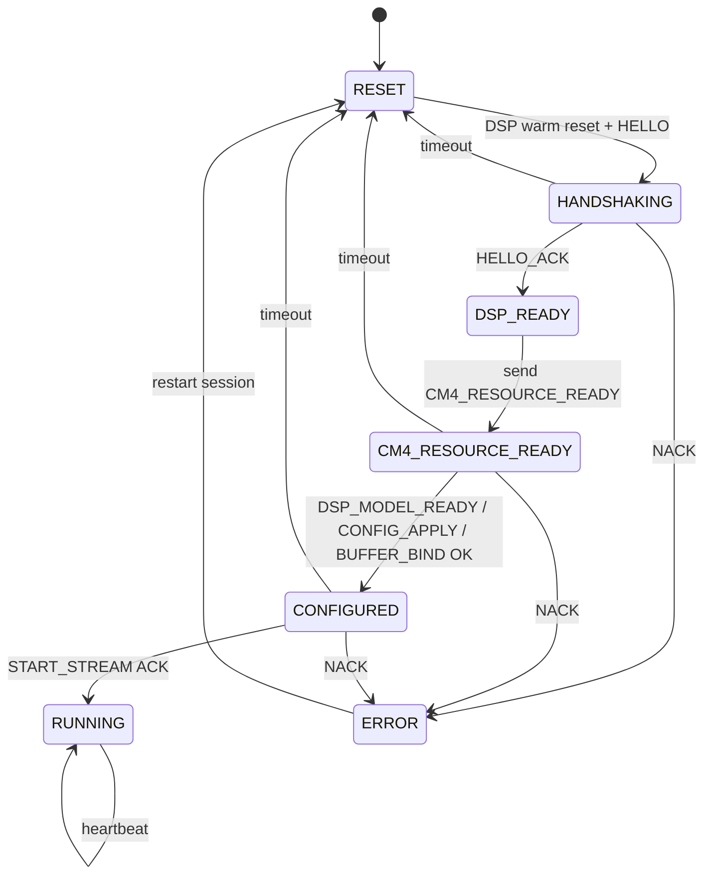
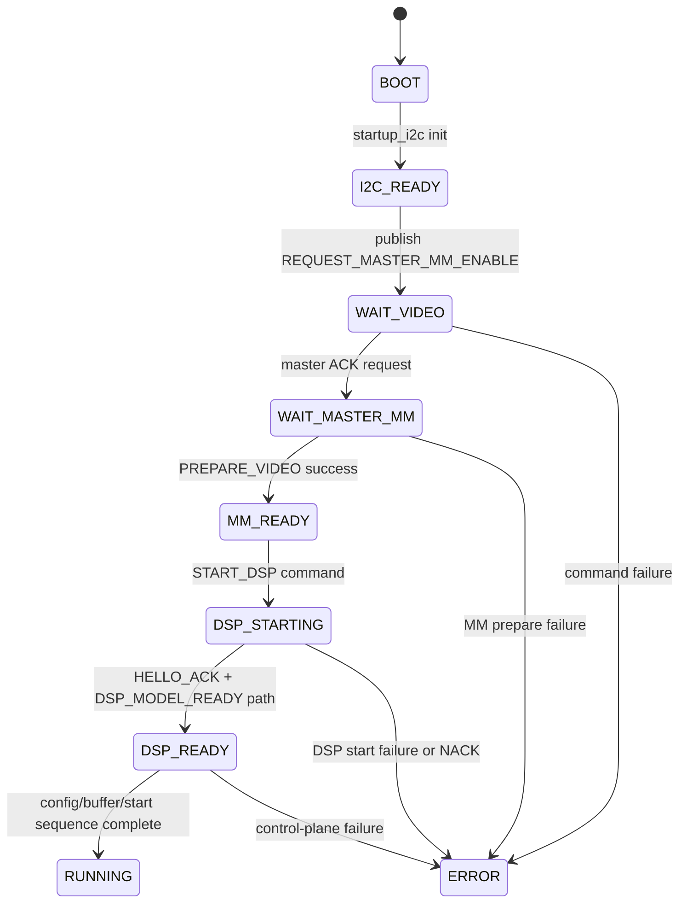
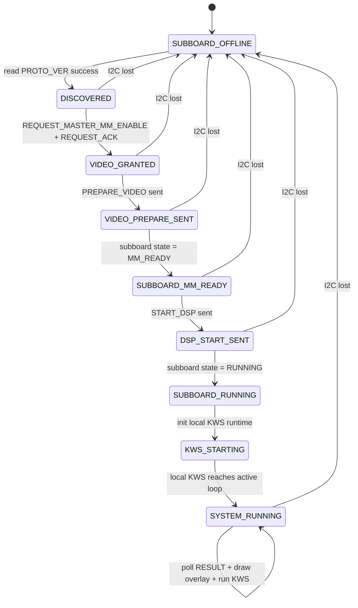

# Gimbal Master / Subboard State Machines

本文档给出当前正式应用的三个状态机视图：

1. 主板本地 KWS 控制状态机。
2. 子板本地视频与 DSP 启动状态机。
3. 主板与子板组合后的联合时序状态机。

## 1. 主板本地 KWS 状态机

对应实现：`Projects/App_GimbalMaster/Src/main.c`

主状态含义如下：

1. `RESET`：重新建立 session，触发 DSP warm reset，清空旧 mailbox。
2. `HANDSHAKING`：持续发送 `HELLO`，等待 `HELLO_ACK`。
3. `DSP_READY`：收到 `HELLO_ACK` 后的过渡态，立即发送 `CM4_RESOURCE_READY`。
4. `CM4_RESOURCE_READY`：等待 `DSP_MODEL_READY`，随后依次推进 `CONFIG_APPLY` 与 `BUFFER_BIND`。
5. `CONFIGURED`：控制面已完成配置，等待 `START_STREAM` 确认。
6. `RUNNING`：KWS 数据面持续运行，并定期发送心跳。
7. `ERROR`：收到 NACK 或进入错误恢复路径，随后重新回到 `RESET`。

## 2. 子板本地启动状态机

对应实现：

1. `Projects/Demo/Subboard_MM_Consumer_Demo/Src/subboard_mm_app.c`
2. `Projects/Demo/Subboard_MM_Consumer_Demo/Src/subboard_mm_app_commands.c`
3. `Projects/Demo/Subboard_MM_Consumer_Demo/Src/subboard_dsp_ctrl.c`
4. `Projects/Demo/Subboard_MM_Consumer_Demo/Src/subboard_dsp_control_plane.c`

子板对外公开的关键状态是：

1. `I2C_READY`：I2C 从机已可被主板访问。
2. `WAIT_VIDEO` / `WAIT_MASTER_MM`：已向主板申请共享视频资源，等待授权与命令。
3. `MM_READY`：本地 MM consumer 已准备完毕，可接受 `START_DSP`。
4. `DSP_STARTING`：DSP 已复位并进入控制面握手。
5. `DSP_READY`：模型与控制面准备完成。
6. `RUNNING`：持续发布检测结果与心跳。
7. `ERROR`：启动或控制面过程失败。

## 3. 主板与子板联合状态机

联合流程由 `Projects/App_GimbalMaster/Src/master_demo_app.c` 主导，对外体现为“主板先授权资源并驱动子板启动，子板进入运行态后再启动本板 KWS”。

联合视角下，主板在每个周期同时做两件事：

1. 在前半阶段只轮询子板状态寄存器，并在条件满足时回写 ACK 或下发命令。
2. 当子板进入 `RUNNING` 后，再启动并推进本板 KWS 控制状态机。

因此系统整体是“先串行启动，后并行运行”：

1. 子板协调服务先独立将子板推进到 `RUNNING`。
2. 随后主板再启动本板 KWS，并进入本地控制面运行态。
3. 系统稳定后，主板同时消费 `RESULT` 做叠框显示，并维持本地 KWS 运行。
