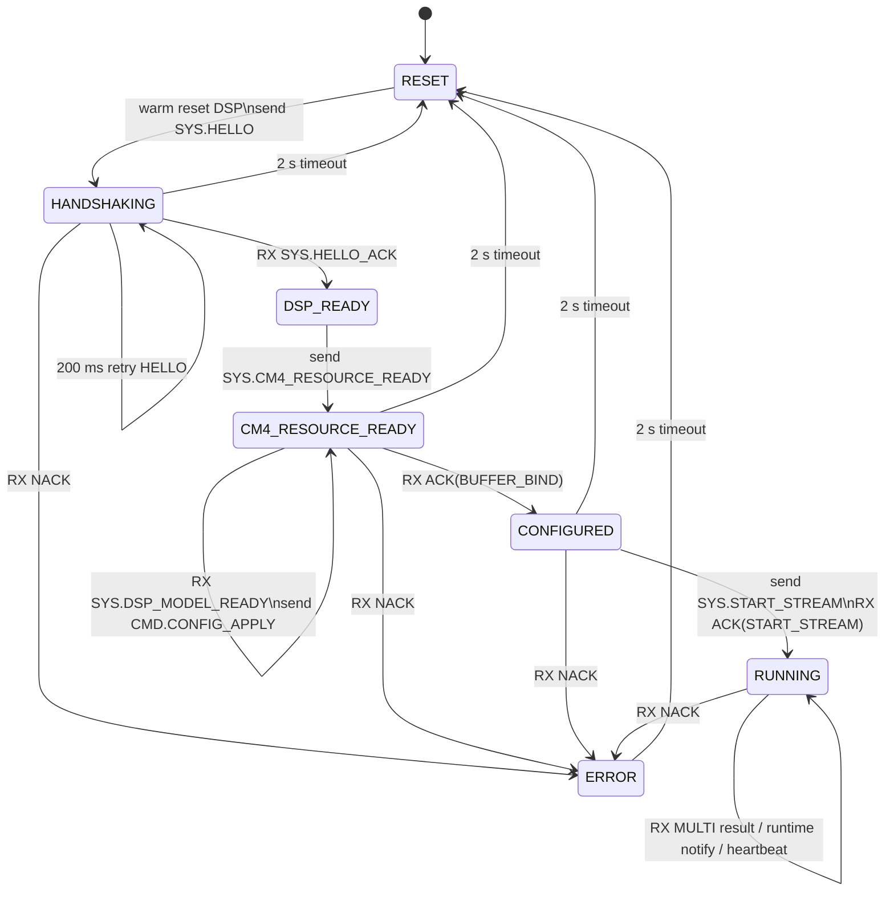
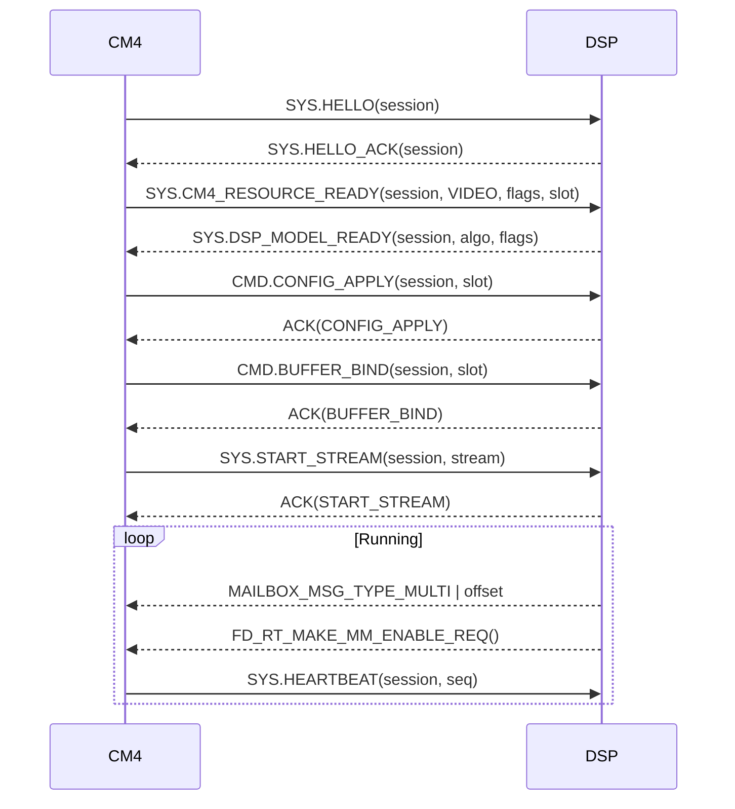

# Face_Detection_State_Machine_Demo

本 Demo 把现有检测显示链路和 CM4-DSP 控制面状态机结合起来，目标是验证人脸检测场景下的最小闭环：

1. CM4 与 DSP 先完成带 session 的控制面握手。
2. CM4 完成摄像头、MM、LCD 初始化后，通过 `SYS.CM4_RESOURCE_READY` 向 DSP 宣告视频资源就绪。
3. DSP 依次返回 `SYS.DSP_MODEL_READY`、`ACK(CONFIG_APPLY)`、`ACK(BUFFER_BIND)`、`ACK(START_STREAM)`，CM4 才进入运行态。
4. 运行态下 DSP 发送 `MAILBOX_MSG_TYPE_MULTI | offset` 上报检测结果；如需 MM 运行态生效，则额外发送统一运行时通知请求，由 CM4 根据板型决定是否同时触发 `CORE_REG_UPDATE` 和 `SPI_REG_UPDATE`。
5. CM4 负责写 MM/LCD 相关寄存器，DSP 不直接改主板视频寄存器。

这个 Demo 刻意不引入追踪逻辑。CM4 不依赖 `track_id`、`miss_count` 或 Kalman 状态；DSP 只要填充一帧人脸框列表即可。

## 架构分工

1. CM4：初始化 camera/MM/LCD、驱动状态机、校验 session、接收 DSP 的 MM 运行态使能请求并按板型触发对应寄存器同步、显示多目标框。
2. DSP：完成控制面响应、做人脸检测、把 `DetectionResult_t` 写入共享内存、通过 mailbox 通知结果偏移，并在需要时发送统一的 MM 运行态使能请求。
3. 数据面：检测结果结构复用 `Algorithm_Models/protocol/detection_proto.h`。
4. 控制面：状态机消息复用 `Algorithm_Models/protocol/control_proto.h`。

`SYS.CM4_RESOURCE_READY` 的语义仅表示 CM4 已完成本板视频资源初始化，不等于 MM/LCD 寄存器已经被 DSP 侧流程“自动刷新”。如果 DSP 需要 MM 配置进入运行态，仍需再发送运行时通知给 CM4。

## CM4 状态机总览

CM4 状态机实现在 `Src/face_detection_app.c`，状态定义如下：

| 状态 | 含义 | 进入动作 |
| --- | --- | --- |
| `RESET` | 发起新一轮会话 | `session_id++`、DSP warm reset、重同步 mailbox、发送 `SYS.HELLO` |
| `HANDSHAKING` | 等待 `HELLO_ACK` | 每 200 ms 重发 `SYS.HELLO` |
| `DSP_READY` | 已收到 `HELLO_ACK` | 打印资源状态、立即发送 `SYS.CM4_RESOURCE_READY` |
| `CM4_RESOURCE_READY` | 等待 `DSP_MODEL_READY` 以及后续配置链路启动 | 每 300 ms 重发 `SYS.CM4_RESOURCE_READY` |
| `CONFIGURED` | `BUFFER_BIND` 已确认 | 立即发送 `SYS.START_STREAM` |
| `RUNNING` | 正常推理和叠框显示 | 每 1000 ms 发送 `SYS.HEARTBEAT`，处理检测结果与运行时通知 |
| `ERROR` | 收到 `NACK` 或初始化失败 | 保持错误态，等待超时后回到 `RESET` |

注意：

1. `DSP_READY` 是短暂过渡态，代码里收到 `HELLO_ACK` 后会立刻发送 `SYS.CM4_RESOURCE_READY` 并切到 `CM4_RESOURCE_READY`。
2. 只要离开 `RUNNING`，叠框缓存就会被清空，避免旧框残留。
3. 所有控制消息都要先做 session 校验；旧 session 的消息会被直接丢弃。

## 状态转移图

上图里 `CM4_RESOURCE_READY -> CONFIGURED` 被压缩表示，实际中间的命令链路是：

1. `RX SYS.DSP_MODEL_READY` 后发送 `CMD.CONFIG_APPLY`
2. `RX ACK(CONFIG_APPLY)` 后发送 `CMD.BUFFER_BIND`
3. `RX ACK(BUFFER_BIND)` 后进入 `CONFIGURED`
4. 进入 `CONFIGURED` 后立即发送 `SYS.START_STREAM`
5. `RX ACK(START_STREAM)` 后进入 `RUNNING`

## 关键时序

## 状态转移动作明细

| 当前状态 | 触发条件 | CM4 动作 | 下一状态 |
| --- | --- | --- | --- |
| `RESET` | 周期调度 | 递增 `session_id`，warm reset DSP，重建 mailbox，同步发送 `SYS.HELLO` | `HANDSHAKING` |
| `HANDSHAKING` | 收到 `SYS.HELLO_ACK` | 记录 DSP 已响应，打印资源状态，发送 `SYS.CM4_RESOURCE_READY` | `CM4_RESOURCE_READY` |
| `HANDSHAKING` | 200 ms 无响应 | 重发 `SYS.HELLO` | `HANDSHAKING` |
| `CM4_RESOURCE_READY` | 收到 `SYS.DSP_MODEL_READY` | 发送 `CMD.CONFIG_APPLY` | `CM4_RESOURCE_READY` |
| `CM4_RESOURCE_READY` | 收到 `ACK(CONFIG_APPLY)` | 发送 `CMD.BUFFER_BIND` | `CM4_RESOURCE_READY` |
| `CM4_RESOURCE_READY` | 收到 `ACK(BUFFER_BIND)` | 清空 pending，发送 `SYS.START_STREAM` | `CONFIGURED` |
| `CONFIGURED` | 收到 `ACK(START_STREAM)` | 输出运行日志 | `RUNNING` |
| `RUNNING` | 收到 runtime notify | 由 CM4 判定并执行 MM 运行态使能所需寄存器写入 | `RUNNING` |
| `RUNNING` | 收到 `MAILBOX_MSG_TYPE_MULTI` | 解析 `DetectionResult_t` 并刷新叠框 | `RUNNING` |
| 任意非 `RESET`/`RUNNING` 状态 | 2 s 无进展 | 打印超时日志并重启会话 | `RESET` |
| 任意状态 | 收到 `NACK` | 清空 pending，进入错误态 | `ERROR` |

## 重试、超时与恢复策略

代码中的时间参数固定如下：

1. `FD_HELLO_RETRY_MS = 200 ms`
2. `FD_RESOURCE_RETRY_MS = 300 ms`
3. `FD_HEARTBEAT_INTERVAL_MS = 1000 ms`
4. `FD_RESPONSE_TIMEOUT_MS = 2000 ms`

恢复策略是“整轮会话重启”，不是在原状态里无限等待：

1. 只要 `HANDSHAKING`、`CM4_RESOURCE_READY`、`CONFIGURED`、`ERROR` 停留超过 2 秒，就回到 `RESET`。
2. 回到 `RESET` 时会递增 `session_id`，因此旧 session 的 `ACK`、`HELLO_ACK`、`STATUS`、`HEARTBEAT` 全部失效。
3. `RUNNING` 不走统一的 2 秒超时分支，默认持续运行，并靠 heartbeat 和运行日志观察活性。

这个设计的目的是把“偶发丢包”和“DSP 落入旧状态”都收敛为一轮新的 session，而不是让 CM4 在中间态继续追加命令。

## 运行时通知约定

1. 消息类型：`FD_RT_MSG_TYPE_MM_ENABLE_REQ = 0x40000000`
2. `payload = 0x1`：请求 CM4 执行一次 MM 运行态使能
3. CM4 根据板型和资源状态决定是否只写 `CORE_REG_UPDATE`，或同时写 `CORE_REG_UPDATE` 与 `SPI_REG_UPDATE`
4. 历史 `payload = 0x2` 会被 CM4 兼容折算到同一条 MM 运行态使能语义
5. 该请求应在 DSP 收到 `START_STREAM ACK` 后再发送；CM4 对过早到达的请求会忽略并打印告警
6. 若 CM4 侧 camera/MM/LCD 资源未全量 ready，请求会被忽略并打印告警

## mailbox 处理优先级

CM4 在 `face_detection_app_tick()` 中先收 mailbox，再推进状态机。收包顺序固定为：

1. 优先识别 Demo 私有运行时通知 `FD_RT_MSG_TYPE_MM_ENABLE_REQ`
2. 再处理控制面消息 `SYS/ACK/NACK/STATUS`，并检查 session 是否匹配
3. 只有在 `RUNNING` 状态，才把其他 mailbox 消息交给 overlay 处理为检测结果

这意味着 DSP 即使在运行态同时发送控制消息和检测结果，CM4 也会先处理控制/同步语义，再处理画框数据。

## 目录说明

1. `Src/main.c`：板级启动、SysTick 和 app tick。
2. `Src/face_detection_app.c`：CM4 控制面状态机、视频链路初始化。
3. `Src/face_detection_overlay.c`：多目标叠框，只处理检测结果，不处理追踪语义。
4. `algorithm_reference/README.md`：DSP 最小实现指引。
5. `model_bin/README.md`：DSP 固件放置约定。

## 当前数据面约定

1. DSP 使用 `MAILBOX_MSG_TYPE_MULTI | offset` 通知一帧结果。
2. `offset` 指向 `DSP_DETECTION_BASE_ADDR` 下的 `DetectionResult_t`。
3. `count` 表示本帧目标数，CM4 只绘制 `FACE` 或 `UNKNOWN` 类型框。
4. `track_id`、`vx/vy`、`speed`、`kf_confidence`、`miss_count` 可以全部填 0。
5. 协议版本兼容 `v2.x` 和 `v3.x` 主版本；magic、version、count 任一不合法时本帧会被丢弃。

## 构建目标

1. `s300_face_detection_state_machine_demo`
2. `dbg_face_detection_state_machine_demo`
3. `img_s300_face_detection_state_machine_demo`

## 建议联调顺序

1. 先只跑通 `HELLO -> HELLO_ACK`。
2. 再跑通 `CM4_RESOURCE_READY -> DSP_MODEL_READY -> ACK(CONFIG_APPLY) -> ACK(BUFFER_BIND) -> ACK(START_STREAM)`。
3. 然后验证 DSP 发送统一的 `FD_RT_MAKE_MM_ENABLE_REQ()` 后，CM4 是否按当前板型正确完成 MM 运行态使能。
4. 最后让 DSP 固定输出两三个静态框，验证坐标、镜像、显示方向。
5. 静态框正确后再接入真实人脸检测推理。
