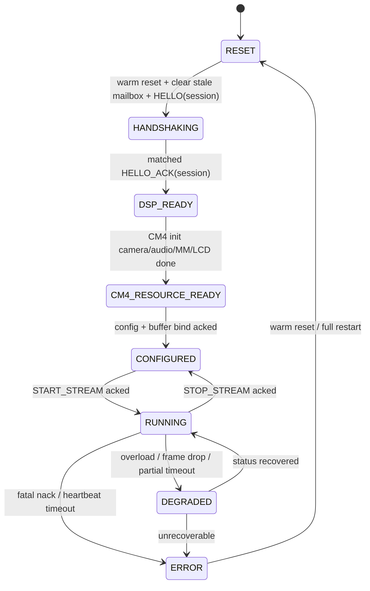
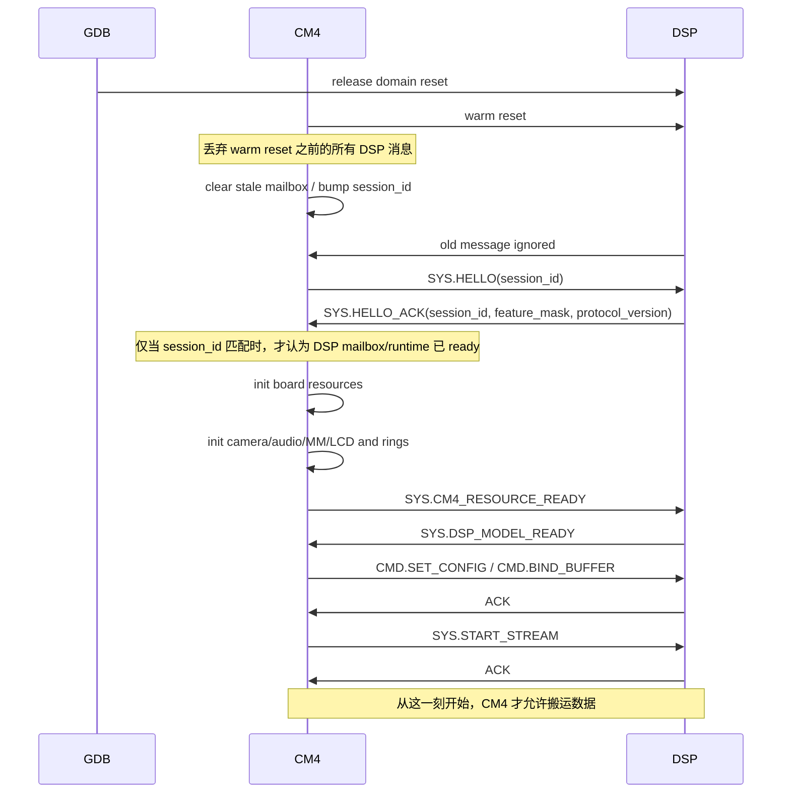
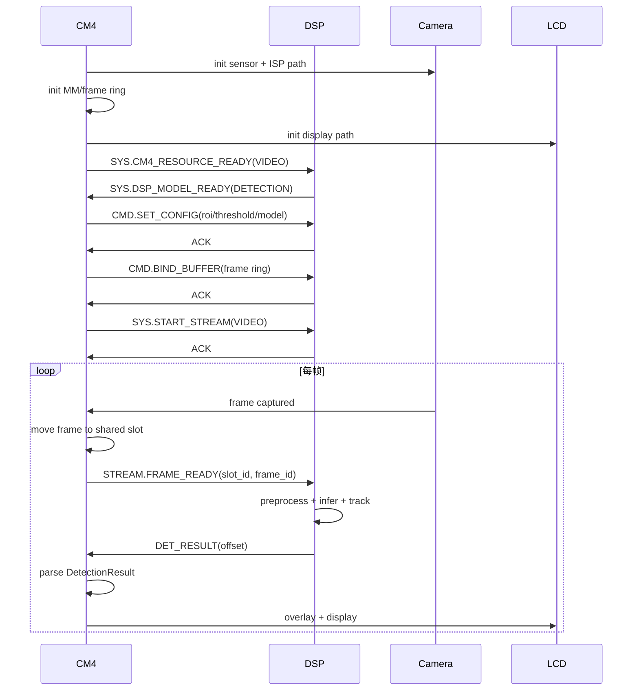
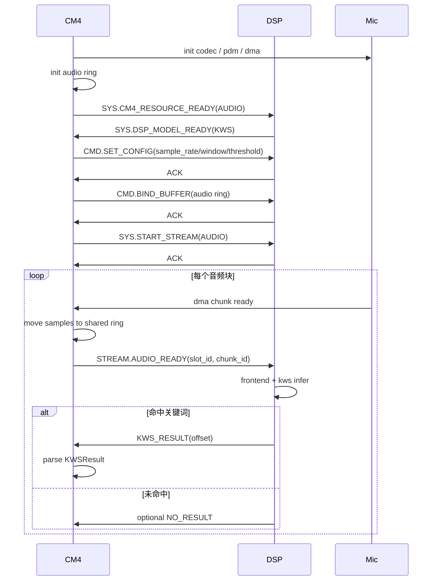

# CM4-DSP 控制与流处理协议草案

## 文档版本

| 版本 | 日期       | 作者    | 说明                                                        |
| ---- | ---------- | ------- | ----------------------------------------------------------- |
| 0.1  | 2026-03-10 | Copilot | 初稿，适配当前仓库的握手、KWS、检测场景                     |
| 0.2  | 2026-03-10 | Copilot | 增加 pre-reset 消息失效规则，明确 CM4 软复位前 DSP 消息无效 |

---

## 1. 目标与边界

本文档用于把当前的握手 demo 扩展成可复用于 KWS、人脸检测、人体检测、跟踪等场景的统一控制协议。

本草案只解决以下问题：

1. CM4 与 DSP 什么时候算“真正 ready”
2. CM4 什么时候可以开始搬运视频/音频数据
3. KWS 与检测类 demo 如何复用同一套控制面
4. Mailbox、共享内存、结果结构体分别承担什么职责

本草案不改变当前仓库已经稳定工作的结果结构体：

1. 检测结果继续复用 [Algorithm_Models/protocol/detection_proto.h](Algorithm_Models/protocol/detection_proto.h)
2. KWS 结果继续复用 [Algorithm_Models/protocol/kws_proto.h](Algorithm_Models/protocol/kws_proto.h)
3. Mailbox 基本格式继续复用 [Drivers/SoC/MAILBOX/Include/mailbox_proto.h](Drivers/SoC/MAILBOX/Include/mailbox_proto.h)

---

## 2. 设计原则

### 2.1 角色分工

CM4 是系统主控，负责系统资源和数据入口；DSP 是算法执行核，负责消费数据和产出结果。

| 资源或动作         | CM4    | DSP    |
| ------------------ | ------ | ------ |
| DSP 启动时序       | 负责   | 被启动 |
| Mailbox 主流程发起 | 负责   | 响应   |
| Camera 初始化      | 负责   | 不负责 |
| MM 初始化          | 负责   | 不负责 |
| LCD 初始化         | 负责   | 不负责 |
| 音频采集外设初始化 | 负责   | 不负责 |
| DMA/搬运数据       | 负责   | 不负责 |
| 模型运行时初始化   | 不负责 | 负责   |
| 算法处理           | 不负责 | 负责   |
| 检测/KWS 结果生成  | 不负责 | 负责   |

### 2.2 强约束

1. DSP 完成握手，不代表可以立即处理数据流。
2. 由于 DSP 可能先于 CM4 启动，在 CM4 触发本轮 DSP warm reset 之前产生的 DSP 消息一律视为无效。
3. 只有当 CM4 明确完成对应外设初始化并发送资源就绪消息后，DSP 才能进入可运行状态。
4. 只有当 DSP 对配置和启动命令返回 ACK 后，CM4 才能开始搬运视频帧或音频块。
5. Mailbox 负责控制面和事件通知，不承载连续大数据本体。
6. 连续数据通过共享内存或环形缓冲区传递；Mailbox 只发送“哪一块数据就绪了”。

### 2.4 pre-reset 消息失效规则

由于 DSP 核可能在 CM4 核启动前就已经上电运行，协议必须显式区分“历史启动实例”和“当前启动实例”。

本草案要求：

1. CM4 每次准备建立控制链路前，都先触发一次本轮 DSP warm reset。
2. 在这次 warm reset 之前，DSP 发送过的任何 mailbox 消息都不能参与本轮握手判定。
3. CM4 在发起本轮 HELLO 之前，需要重新同步 mailbox，并清空可能残留的旧消息。
4. DSP 只有在收到本轮 HELLO 之后，才允许发送可被 CM4 采信的 HELLO_ACK、STATUS、结果通知。

建议实现上引入 `session_id` 或 `epoch_id`：

1. `session_id` 由 CM4 在每轮 warm reset 后递增，并随 HELLO 下发。
2. DSP 只有在接收并锁定当前 `session_id` 后，才开始发送本轮有效消息。
3. CM4 对所有 DSP→CM4 控制消息都校验 `session_id`，不匹配则直接丢弃。

如果当前阶段不想马上扩展消息编码，那么最小可落地策略就是：

1. CM4 触发 warm reset
2. 等待 DSP 基础初始化完成
3. CM4 重新初始化 mailbox / 清 FIFO
4. 仅把这之后收到的首个有效 HELLO_ACK 视为本轮握手响应

### 2.3 分层模型

| 层次   | 作用                                     | 建议载体                  |
| ------ | ---------------------------------------- | ------------------------- |
| 启动层 | 启动、复位、基础握手                     | Mailbox                   |
| 控制层 | 配置、模式切换、启动停止、ACK/NACK、状态 | Mailbox                   |
| 数据层 | 视频帧、音频块、共享配置块               | 共享内存 / Ring Buffer    |
| 结果层 | 检测结果、KWS 结果、识别结果             | 共享结构体 + Mailbox 通知 |

---

## 3. 生命周期状态机

### 3.1 系统状态定义

| 状态               | 含义                        | 进入条件                       | 退出条件                           |
| ------------------ | --------------------------- | ------------------------------ | ---------------------------------- |
| RESET              | 本轮尚未建立可信会话        | 上电或复位                     | CM4 触发本轮 warm reset 并清旧消息 |
| HANDSHAKING        | 双方建立本轮控制链路        | CM4 发 HELLO(session_id)       | DSP 回同 session 的 HELLO_ACK      |
| DSP_READY          | DSP 运行时和 mailbox 已就绪 | HELLO 成功且 session 校验通过  | 等待 CM4 资源 ready                |
| CM4_RESOURCE_READY | CM4 已完成外设与缓冲初始化  | camera/audio/MM/LCD 初始化完成 | DSP 配置完成                       |
| CONFIGURED         | 双方配置一致                | SET_CONFIG / BIND_BUFFER 成功  | START_STREAM                       |
| RUNNING            | DSP 正式消费数据流          | START_STREAM ACK               | STOP_STREAM / ERROR                |
| DEGRADED           | 仍在运行但存在退化          | 连续超时、掉帧、过载           | 恢复或 STOP                        |
| ERROR              | 需要人工/系统恢复           | NACK 致命错误或 heartbeat 超时 | RESET / RECOVER                    |

### 3.2 Mermaid 状态图



### 3.3 最关键的门槛

当前仓库里最容易混淆的是“DSP 已启动”和“数据流可启动”这两个概念。草案要求把它们明确拆开：

1. CM4 只有在触发本轮 warm reset 并清理旧 mailbox 后，才能开始相信 DSP 消息。
2. HELLO_ACK 只表示 DSP 的基础运行时、mailbox、协议栈 ready，而且必须属于当前 `session_id`。
3. CM4_RESOURCE_READY 才表示 camera、MM、LCD 或音频采集链路已经准备好。
4. START_STREAM_ACK 之后，CM4 才允许真正开始搬运数据。

也就是说，视频和音频都必须满足：

DSP ready 只是前提，CM4 资源 ready 才能进入配置阶段；配置完成并收到启动 ACK 后，CM4 才开始搬运数据。

---

## 4. 消息类型表

### 4.1 总体策略

保持当前 32-bit Mailbox 基本格式不变：高 4 位表示类型，低 28 位表示 payload 或索引。

对于需要传更多参数的控制命令，Mailbox 只传 opcode 和小参数，或者传共享控制块索引；不要在 mailbox 里直接塞复杂结构体。

### 4.2 Mailbox 顶层消息类型

| Type | 方向    | 名称         | 作用                               | 与当前仓库关系         |
| ---- | ------- | ------------ | ---------------------------------- | ---------------------- |
| 0x1  | DSP→CM4 | DET_RESULT   | 检测结果就绪通知                   | 复用现有 MULTI         |
| 0x2  | DSP→CM4 | KWS_RESULT   | KWS 结果就绪通知                   | 复用现有 KWS           |
| 0x3  | DSP→CM4 | RECOG_RESULT | 识别结果就绪通知                   | 复用现有 RECOGNITION   |
| 0x5  | 双向    | SYS          | 系统握手、资源就绪、启动停止、心跳 | 建议扩展当前握手 demo  |
| 0x8  | CM4→DSP | CMD          | 配置/模式/算法控制                 | 复用现有命令框架       |
| 0x9  | DSP→CM4 | ACK          | 对 0x5 或 0x8 的成功确认           | 当前文档预留，建议启用 |
| 0xA  | DSP→CM4 | NACK         | 拒绝执行并附错误码                 | 当前文档预留，建议启用 |
| 0xE  | DSP→CM4 | STATUS       | 周期状态、退化状态、诊断事件       | 当前文档预留，建议启用 |
| 0xF  | DSP→CM4 | NO_RESULT    | 当前周期无结果                     | 复用现有定义           |

### 4.3 SYS 子类型建议

建议把 Type 0x5 作为系统控制面专用消息，低 28 位按“子类型 + 参数”解释。

| 子类型 | 方向    | 名称               | 含义                                                    |
| ------ | ------- | ------------------ | ------------------------------------------------------- |
| 0x01   | CM4→DSP | HELLO              | 发起系统握手，带 session 和协议版本                     |
| 0x02   | DSP→CM4 | HELLO_ACK          | 返回协议版本、feature mask、boot reason，并回显 session |
| 0x03   | CM4→DSP | CM4_RESOURCE_READY | CM4 外设、buffer、搬运通道均已 ready                    |
| 0x04   | DSP→CM4 | DSP_MODEL_READY    | DSP 模型、内部 buffer、前处理 ready                     |
| 0x05   | CM4→DSP | START_STREAM       | 请求 DSP 开始接收数据流                                 |
| 0x06   | CM4→DSP | STOP_STREAM        | 请求 DSP 停止处理数据流                                 |
| 0x07   | 双向    | HEARTBEAT          | 存活、负载、队列深度、错误摘要                          |
| 0x08   | CM4→DSP | RECOVER_REQ        | 请求软恢复、清状态、重绑 buffer                         |
| 0x09   | DSP→CM4 | RECOVER_DONE       | 恢复完成，可重新配置                                    |

### 4.3.1 session_id 的 mailbox 编码草案

为了在不破坏当前 32-bit mailbox 基本格式的前提下引入“本轮会话”概念，建议在控制面消息中引入一个轻量级 `session_id`。

本草案建议：

1. `session_id` 先采用 8 bit，范围 `0x00 ~ 0xFF`
2. `session_id` 仅用于控制面消息，不强制嵌入检测/KWS 结果结构体
3. `session_id` 由 CM4 在每轮 warm reset 后递增
4. DSP 收到本轮 `HELLO(session_id)` 之前发送的所有控制消息都应被 CM4 丢弃

推荐编码原则：

1. `Type[31:28]` 保持不变
2. `SubType[27:24]` 用于区分 SYS 子类型或 ACK/NACK 的响应类别
3. `session_id[23:16]` 固定预留给当前会话号
4. `Arg[15:0]` 用于版本、特性、错误码、状态字等短参数

这样做的好处是：

1. 32-bit 单消息就能携带本轮会话号
2. 不需要立刻引入共享控制块才能完成会话隔离
3. ACK/NACK/HEARTBEAT 都可以直接校验是否属于本轮 session

### 4.3.2 SYS 类型位域定义

建议将 `Type = 0x5` 的 SYS 消息统一编码为：

```text
31            28 27            24 23            16 15             0
┌──────────────┬────────────────┬────────────────┬─────────────────┐
│ Type = 0x5   │ SYS SubType    │   session_id   │       Arg       │
└──────────────┴────────────────┴────────────────┴─────────────────┘
```

其中：

1. `SYS SubType` 对应上一节定义的 `HELLO / HELLO_ACK / RESOURCE_READY / START_STREAM / HEARTBEAT`
2. `session_id` 是本轮有效会话号
3. `Arg` 的具体含义由不同子类型解释

### 4.3.3 关键 SYS 消息编码建议

#### HELLO

CM4→DSP，用于声明“从这一轮开始，以这个 session 为准”。

```text
31..28: 0x5
27..24: 0x1   (HELLO)
23..16: session_id
15..8 : protocol_major
7..0  : protocol_minor
```

示例：

```text
SYS.HELLO(session=0x23, proto=1.2)
= 0x51230102
```

由于实际只有 32 bit，写成字段拼装后应理解为：

```c
msg = (0x5u << 28) | (0x1u << 24) | (session_id << 16) |
    (protocol_major << 8) | protocol_minor;
```

如果当前协议版本仍沿用 `0x0100` 这种 16-bit 表示，也可以直接把 `Arg[15:0]` 作为 `protocol_version`。

#### HELLO_ACK

DSP→CM4，用于回显当前会话并声明 DSP 当前能力。

```text
31..28: 0x5
27..24: 0x2   (HELLO_ACK)
23..16: session_id
15..12: boot_reason
11..8 : feature_level
7..0  : dsp_state
```

建议字段语义：

1. `boot_reason`: 区分 power-on / domain release / warm reset / recover
2. `feature_level`: 当前启用的算法域级别，作为 feature mask 的摘要
3. `dsp_state`: `INIT / READY / DEGRADED / ERROR`

如果需要完整 `feature_mask`，建议在 `HELLO_ACK` 后补一个 `DSP_MODEL_READY` 或 `STATUS` 消息，或者走共享配置块。

#### CM4_RESOURCE_READY

CM4→DSP，用于告诉 DSP：本轮可以开始接受配置和 buffer 绑定，但还不能自动开流。

```text
31..28: 0x5
27..24: 0x3
23..16: session_id
15..12: input_type     (0=none, 1=video, 2=audio, 3=video+audio)
11..8 : resource_flags (camera/mm/lcd/audio dma ready)
7..0  : config_slot_id
```

#### START_STREAM

CM4→DSP，表示允许本轮数据流正式开始。

```text
31..28: 0x5
27..24: 0x5
23..16: session_id
15..8 : stream_id
7..0  : start_flags
```

这里的 `stream_id` 建议由 CM4 为 video / audio / mixed stream 分配，便于未来一套协议支持多输入流。

#### HEARTBEAT

建议后续把当前 heartbeat demo 里的专用值逐步收敛到 SYS.HEARTBEAT 风格。

```text
31..28: 0x5
27..24: 0x7
23..16: session_id
15..8 : seq
7..0  : status_or_load
```

这样 HEARTBEAT 自带 `session_id`，不会把历史实例的 heartbeat 误判成当前实例的存活信号。

### 4.3.4 ACK / NACK / STATUS 的 session_id 编码

为了让控制命令闭环，建议 ACK / NACK / STATUS 也采用相同的会话字段布局。

#### ACK

```text
31..28: 0x9
27..24: rsp_kind     (0=SYS, 1=CMD)
23..16: session_id
15..8 : opcode_or_group
7..0  : ack_code
```

#### NACK

```text
31..28: 0xA
27..24: rsp_kind
23..16: session_id
15..8 : opcode_or_group
7..0  : error_code
```

#### STATUS

```text
31..28: 0xE
27..24: status_kind
23..16: session_id
15..8 : run_state
7..0  : status_brief
```

如果 `error_code` 或 `status_brief` 不够用，再通过共享状态块扩展；但第一层过滤仍然优先依赖 `session_id`。

### 4.3.5 数据面消息是否需要携带 session_id

本草案建议分两阶段推进：

第一阶段：

1. 只要求控制面消息携带 `session_id`
2. 检测结果与 KWS 结果结构保持不变
3. 结果就绪消息是否有效，由“当前 stream 已 START 且 session 匹配”这一前置状态保证

第二阶段：

1. 可在 `DetectionResult_t` / `KWSResult_t` 中增加 `session_id`
2. 或在 `DET_RESULT(offset)` / `KWS_RESULT(offset)` 的高位 payload 中复用少量 bit 编码会话号

当前仓库更适合先做第一阶段，因为对现有结果结构影响最小。

### 4.3.6 一轮完整编码示例

假设：

1. 本轮 `session_id = 0x23`
2. 协议版本 `1.0`
3. 输入类型为视频 `input_type = 1`
4. `stream_id = 0x01`
5. heartbeat 序列号 `seq = 0x05`

则一轮典型控制面消息可以表达为：

```text
HELLO              = [0x5][0x1][0x23][0x0100]
HELLO_ACK          = [0x5][0x2][0x23][boot/state]
CM4_RESOURCE_READY = [0x5][0x3][0x23][video/resource_flags]
START_STREAM       = [0x5][0x5][0x23][stream_id/start_flags]
ACK(START_STREAM)  = [0x9][SYS ][0x23][0x05/OK]
HEARTBEAT          = [0x5][0x7][0x23][0x05/status]
```

CM4 的接收规则应为：

1. 若 `session_id != current_session_id`，直接丢弃
2. 若 `session_id == current_session_id`，再按 `Type/SubType` 做状态机处理
3. 即使消息格式正确，只要会话号不匹配，也不能进入当前轮次状态迁移

### 4.4 CMD 命令组建议

保留 [Drivers/SoC/MAILBOX/Include/mailbox_proto.h](Drivers/SoC/MAILBOX/Include/mailbox_proto.h) 现有命令组，并做最小扩展。

| CmdGrp     | 现状     | 建议用途                                  |
| ---------- | -------- | ----------------------------------------- |
| 0x0 BASIC  | 已有     | START/STOP/RESET，不再只局限 tracking     |
| 0x1 SELECT | 已有     | 目标选择、结果通道选择                    |
| 0x2 MODE   | 已有     | 检测模式、KWS 模式、调试模式              |
| 0x3 GIMBAL | 已有     | 云台反馈、运动补偿输入                    |
| 0x4 CONFIG | 已有     | 阈值、模型参数、采样率、ROI               |
| 0x5 BUFFER | 新增建议 | 绑定共享帧缓冲、音频环形缓冲              |
| 0x6 STREAM | 新增建议 | frame ready、audio chunk ready 的策略配置 |
| 0xF SYSTEM | 已有     | ping、版本查询、诊断请求                  |

### 4.5 ACK / NACK 最小字段建议

| 消息   | 最少字段                                          |
| ------ | ------------------------------------------------- |
| ACK    | req_type, req_group, req_opcode, status=OK        |
| NACK   | req_type, req_group, req_opcode, error_code       |
| STATUS | run_state, queue_depth, last_frame_id, last_error |

建议错误码至少统一以下几类：

| 错误码 | 含义            |
| ------ | --------------- |
| 0x01   | 协议版本不兼容  |
| 0x02   | feature 不支持  |
| 0x03   | 配置非法        |
| 0x04   | 资源未 ready    |
| 0x05   | buffer 绑定失败 |
| 0x06   | DSP 忙或队列满  |
| 0x07   | 数据格式不匹配  |
| 0x08   | 模型未 ready    |

---

## 5. 控制块与数据块建议

### 5.1 SystemConfigBlock

对于超过 24 bit 小参数空间的配置项，建议使用共享配置块。

典型字段如下：

1. protocol_version
2. session_id / epoch_id
3. feature_mask
4. active_algo
5. input_type，区分 VIDEO / AUDIO
6. frame_width / frame_height / pixel_format
7. sample_rate / channels / chunk_samples
8. result_mode，区分 DETECT_ONLY / TRACKING / KWS_ONLY
9. ring_buffer base / size / slot_count

Mailbox 里不直接传整个结构，只传配置块索引或版本号。

### 5.2 视频数据面

视频帧本体不走 mailbox。

建议流程：

1. CM4 初始化 camera、MM、LCD
2. CM4 分配 frame ring
3. CM4 用 BUFFER/BIND 命令把 frame ring 描述告诉 DSP
4. CM4 收到 ACK 后，才开始送帧
5. 每帧只通过 mailbox 发送 FRAME_READY 或 slot_id 就绪通知

### 5.3 音频数据面

音频块本体也不走 mailbox。

建议流程：

1. CM4 初始化 mic、codec、I2S/PDM、DMA
2. CM4 分配 audio ring
3. CM4 用 BUFFER/BIND 命令把 audio ring 描述告诉 DSP
4. DSP ACK 后，CM4 才开始把 chunk 搬运进 ring
5. 每个 chunk 只发 AUDIO_READY 通知

---

## 6. 统一时序

### 6.1 通用启动时序



### 6.2 视频检测统一时序



### 6.3 音频 KWS 统一时序



### 6.4 检测与 KWS 的统一点

虽然视频和音频数据类型不同，但控制层应完全一致：

1. 先握手
2. 再确认 CM4 资源 ready
3. 再下发配置
4. 再绑定 buffer
5. 收到 START ACK 后，CM4 才开始搬运数据
6. DSP 只对“已通知 ready 的数据块”负责处理

---

## 7. 与当前仓库的对应关系

### 7.1 可以直接复用的部分

| 现有文件                                                                                   | 建议复用方式                          |
| ------------------------------------------------------------------------------------------ | ------------------------------------- |
| [Algorithm_Models/protocol/detection_proto.h](Algorithm_Models/protocol/detection_proto.h) | 继续作为检测结果数据面协议            |
| [Algorithm_Models/protocol/kws_proto.h](Algorithm_Models/protocol/kws_proto.h)             | 继续作为 KWS 结果数据面协议           |
| [Drivers/SoC/MAILBOX/Include/mailbox_proto.h](Drivers/SoC/MAILBOX/Include/mailbox_proto.h) | 继续作为 mailbox 顶层类型和命令组框架 |
| [Algorithm_Models/protocol/handshake_proto.h](Algorithm_Models/protocol/handshake_proto.h) | 可演进为 system control proto         |
| [docs/CM4_DSP_Handshake_Design.md](docs/CM4_DSP_Handshake_Design.md)                       | 保留当前 bring-up 和实测地址说明      |

### 7.2 当前 demo 的不足

当前握手 demo 已经足够证明 mailbox 链路、重启顺序和 heartbeat 正常，但还缺：

1. CM4 资源 ready 的显式阶段
2. 配置 ACK / NACK
3. buffer 绑定协议
4. stream start / stop 的显式控制
5. 对视频与音频统一的数据就绪通知

### 7.3 建议的最小演进路径

第一阶段：不改结果结构，只把 handshake 扩成系统控制面。

第二阶段：增加 ACK/NACK/STATUS，补齐配置与资源绑定。

第三阶段：把视频帧和音频块统一成“共享缓冲 + mailbox ready 通知”模型。

---

## 8. 最小落地建议

如果只做最小改造，建议按下面顺序推进：

1. 在共享协议里新增 `SYS.CM4_RESOURCE_READY`、`SYS.DSP_MODEL_READY`、`SYS.START_STREAM`、`SYS.STOP_STREAM`
2. 启用当前预留的 `ACK`、`NACK`、`STATUS`
3. 给视频和音频各定义一个 buffer 描述块
4. 让 CM4 只在 `START_STREAM ACK` 后开始搬运数据
5. 保持 detection 和 kws 的结果结构不变

---

## 9. 一句话结论

适配当前仓库的最合理方案，不是让 DSP 在握手后立刻“自己开跑”，而是把系统明确分成两段：

1. 握手成功，只代表 DSP 控制面 ready。
2. 只有当 CM4 完成 camera/MM/LCD 或音频外设初始化，并且 DSP 对配置和启动命令返回 ACK 后，CM4 才开始搬运数据，DSP 才开始处理数据流。