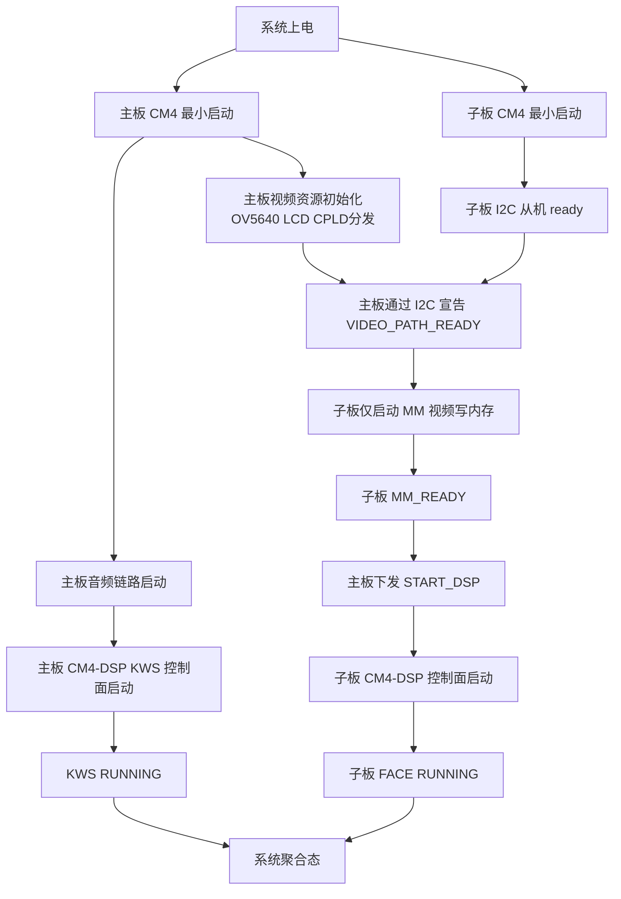
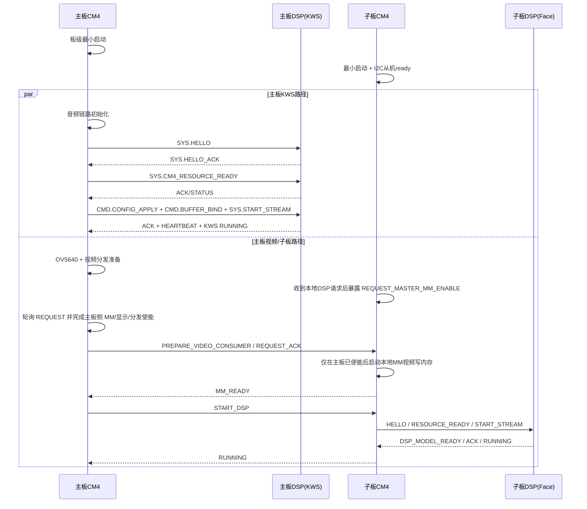

# 主板 KWS + 子板人脸检测 启动架构设计

> **版本**: v1.6  
> **日期**: 2026-03-12  
> **状态**: 设计稿  
> **适用硬件**: Gimbal Master 主板 + AI 子板  
> **目标组合**: 主板 DSP 运行 KWS，子板 DSP 运行人脸检测

---

## 0. 修订历史

- v1.3 / 2026-03-11: 新增推荐验证顺序与 Demo 规划，明确先测主板 KWS、再测 I2C、再测子板 MM-only、最后联调人脸检测
- v1.6 / 2026-03-12: 补充双板人脸检测启动前置检查项，明确子板 START_DSP 前必须先完成 DSP PLL 初始化；同步记录主板/子板 Demo 模块化拆分原则
- v1.5 / 2026-03-12: 统一人脸检测 DSP 运行时协议为单条 `MM_ENABLE` 请求；由 CM4 根据板型决定具体寄存器写入，旧 `CORE/SPI` 细分请求仅作兼容折算
- v1.2 / 2026-03-11: 新增统一启动阶段对齐表，明确主板聚合态、主板 KWS 控制面、板间 I2C、子板对外状态和子板人脸控制面的阶段映射
- v1.1 / 2026-03-11: 补充主板 CM4 与主板 DSP 的 KWS 控制面状态交互，明确系统共有三条启动交互链路
- v1.0 / 2026-03-11: 初版，定义主板 KWS 与子板人脸检测的启动分层、状态机、I2C 协议和实现分工

---

## 1. 文档目标

本文档只解决一件事：

**明确主板、子板、CM4、DSP 在启动阶段各自负责什么，以及它们如何协同进入稳定运行态。**

本文档不直接规定具体代码实现细节，但应能直接指导以下代码落地：

1. 主板 KWS 启动与运行代码
2. 子板人脸检测启动与运行代码
3. 主板与子板之间的 I2C 启动协商代码
4. 子板内部 CM4 与 DSP 的控制面状态机代码

---

## 2. 设计范围与非目标

### 2.1 设计范围

本文覆盖以下启动相关链路：

1. 主板板级资源初始化：OV5640、LCD、主板显示链路、视频分发准备
2. 主板 KWS 子系统启动：音频采集、主板 DSP 启动、KWS 运行态
3. 子板最小系统启动：基础时钟、PSRAM、I2C 从机、状态寄存器
4. 子板视频消费链路启动：仅初始化 MM 到内存的视频写入，不初始化 OV5640 和 LCD
5. 子板 DSP 启动：复用现有人脸检测控制面状态机，拉起模型与检测结果输出
6. 主板与子板的运行态健康检查：状态、错误码、心跳、恢复策略

### 2.2 非目标

本文暂不展开以下主题：

1. 人脸检测算法本身的模型结构和推理细节
2. KWS 算法本身的模型结构和阈值调优
3. 跟踪、目标融合、云台控制策略
4. 人脸识别、手势识别、多子板并行调度细节
5. 量产阶段的固件升级和版本管理机制

---

## 3. 系统结论

### 3.1 核心结论

系统启动必须拆成三条交互链路，不能混成一层：

1. **主板板内控制面**：主板 CM4 与主板 DSP 通过 Mailbox 完成 KWS 启动与运行态维护。
2. **板间启动状态机**：主板 CM4 与子板 CM4 通过 I2C 协商共享视频资源是否可用。
3. **子板板内控制面**：子板 CM4 与子板 DSP 通过 Mailbox 完成人脸检测算法启动。

### 3.2 为什么必须分层

原因很直接：

1. 主板 CM4 和主板 DSP 之间关心的是“音频资源是否 ready、KWS 模型是否 ready、KWS 流是否进入运行态”。
2. 主板和子板之间关心的是“共享视频资源是否已经就绪”，例如摄像头、视频分发和显示链路。
3. 子板 CM4 和子板 DSP 之间关心的是“本地算法是否已经进入运行态”，例如 `HELLO_ACK`、`DSP_MODEL_READY`、`START_STREAM ACK`。
4. 如果把三条交互链路混在一起，主板会同时承担 KWS 本地控制和子板 DSP 细节理解，系统边界会变乱，调试也会困难。

因此，本设计坚持以下边界：

1. **主板不直接参与子板 DSP 协议细节。**
2. **主板 DSP 只通过主板 CM4 暴露 KWS 运行态，不直接参与板间 I2C 协议。**
3. **子板对外只暴露阶段性状态，不暴露内部每条 Mailbox 控制消息。**
4. **主板 KWS 与子板人脸检测是两个并行子系统，只在系统聚合层汇总状态，不互相阻塞算法控制面。**

---

## 4. 总体架构

### 4.1 功能分工

| 处理单元 | 主要职责                                                            | 不负责的内容                    |
| -------- | ------------------------------------------------------------------- | ------------------------------- |
| 主板 CM4 | 板级外设初始化、视频分发准备、音频采集、I2C 主机、系统状态聚合      | 子板 DSP 协议细节、人脸检测推理 |
| 主板 DSP | KWS 推理、KWS 结果输出                                              | 摄像头初始化、子板控制          |
| 子板 CM4 | 最小系统启动、I2C 从机、视频 MM 消费链路启动、子板 DSP 控制面状态机 | OV5640 初始化、LCD 初始化、KWS  |
| 子板 DSP | 人脸检测推理、检测结果输出                                          | 板间 I2C 协商、共享外设初始化   |

### 4.2 启动依赖关系

主板 KWS 与子板人脸检测的依赖关系如下：

1. **主板 KWS 启动依赖音频链路，不依赖子板视频链路。**
2. **子板人脸检测启动依赖主板视频资源已经准备好。**
3. **子板 DSP 启动依赖子板 MM 已经 ready。**
4. **主板系统聚合态可定义为部分 ready 或全部 ready，但不应因为子板未 ready 而阻塞主板 KWS。**

### 4.3 系统启动总览

---

## 4.4 启动前置检查清单

进入双板联调前，至少确认以下前置条件已经满足：

1. 主板 OV5640、MM PLL、视频分发链路已经由主板 CM4 完成初始化。
2. 子板只初始化本地 MM 消费路径，不重复初始化 OV5640 和 LCD。
3. 子板在执行 `START_DSP` 前，必须先完成 DSP PLL 初始化，例如 `rcc_init_dsp_pll(6, 800, 0, 2, 2)`。
4. 调试态必须同时恢复 CM4 镜像和 DSP bin；如果只下载 CM4 ELF，子板 DSP 控制面不会真正进入可运行状态。
5. 主板显示叠框属于主板本地职责，修改显存 alpha/color buffer 后需要显式触发显示刷新。

## 4.5 Demo 模块化约束

为避免启动样例继续膨胀，建议保持以下文件边界：

1. `main.c` 只保留板级初始化、时基建立和 app 调度。
2. 主板 Demo 将板间启动状态机放入 app 模块，将 LCD 叠框放入 overlay 模块。
3. 子板 Demo 将 I2C 启动状态机、MM/DSP 启动与结果发布集中到 app 模块，DSP mailbox 控制面维持独立模块。
4. 新增功能优先放到现有 app 或 overlay 模块，避免再次把业务逻辑回填进 `main.c`。

---

## 5. 启动分层设计

### 5.1 第一层：主板 CM4 <-> 主板 DSP 的 KWS 控制面

这一层负责主板内部的 KWS 生命周期管理。

它回答的是以下问题：

1. 主板 DSP 是否已经完成握手。
2. 主板音频资源是否已经 ready。
3. KWS 是否已经进入持续运行态。

这一层建议直接复用现有 `KWS_Control_Protocol_Demo` 控制面：

1. `SYS.HELLO`
2. `SYS.HELLO_ACK`
3. `SYS.CM4_RESOURCE_READY`
4. `CMD.CONFIG_APPLY`
5. `CMD.BUFFER_BIND`
6. `SYS.START_STREAM`
7. `SYS.HEARTBEAT`
8. `ACK(kind=SYS/CMD, ...)`

这里的资源 ready 语义是：

1. 音频采集链路已完成初始化。
2. 音频共享内存缓冲已准备完毕。
3. 主板 DSP 可以开始消费音频块并输出 KWS 结果。

### 5.2 第二层：主板 CM4 <-> 子板 CM4 的 I2C 启动协商

这一层的目标是回答三个问题：

1. 子板是否已经上线并可通信。
2. 主板是否已经把共享视频资源准备好。
3. 子板是否已经把视频消费链路和本地 DSP 拉起。

这一层只关注板级资源和阶段状态，不直接传输检测结果以外的算法控制消息。

### 5.3 第三层：子板 CM4 <-> 子板 DSP 的控制面状态机

这一层复用现有人脸检测 Demo 的控制面设计：

1. `SYS.HELLO`
2. `SYS.HELLO_ACK`
3. `SYS.CM4_RESOURCE_READY`
4. `SYS.DSP_MODEL_READY`
5. `CMD.CONFIG_APPLY`
6. `CMD.BUFFER_BIND`
7. `SYS.START_STREAM`
8. `ACK(kind=SYS/CMD, ...)`

该状态机由子板内部自行完成，主板只读取子板最终阶段状态。

### 5.4 三条交互链路之间的关系

推荐的串联关系如下：

1. 主板 KWS 控制面和主板视频资源初始化可以并行推进。
2. 主板视频资源 ready 之前，子板只能停留在 `WAIT_VIDEO_READY`。
3. 主板发出视频资源 ready 信号后，子板才能进入 `MM_STARTING`。
4. 子板进入 `MM_READY` 后，主板才允许下发 `START_DSP`。
5. 子板进入 `DSP_STARTING` 后，内部开始跑人脸检测控制面状态机。
6. 主板内部 KWS 控制面进入 `RUNNING` 后，主板即可独立提供语音功能，不需要等待子板 ready。
7. 子板内部控制面进入 `RUNNING` 后，对外 I2C 状态更新为 `RUNNING`。

---

## 6. 各处理单元状态机设计

### 6.1 主板系统聚合状态机

建议主板维护一个系统聚合状态，而不是把所有细节塞进某个任务里。

建议状态：

1. `MASTER_BOOTING`
2. `KWS_STARTING`
3. `KWS_RUNNING`
4. `VIDEO_STARTING`
5. `VIDEO_READY`
6. `SUBBOARD_WAIT_ONLINE`
7. `SUBBOARD_WAIT_MM_READY`
8. `SUBBOARD_WAIT_RUNNING`
9. `SYSTEM_PARTIAL_READY`
10. `SYSTEM_FULL_READY`
11. `SYSTEM_DEGRADED`
12. `SYSTEM_ERROR`

状态含义：

1. `KWS_RUNNING` 表示主板语音链路已经可用。
2. `VIDEO_READY` 表示主板已经完成共享视频资源初始化。
3. `SYSTEM_PARTIAL_READY` 表示 KWS 可用，但子板人脸检测未进入运行态。
4. `SYSTEM_FULL_READY` 表示 KWS 和子板人脸检测都可用。

### 6.2 主板内部 CM4-DSP KWS 状态机

建议主板内部明确维护 KWS 控制面状态，避免把 KWS 简化成“DSP 已启动”这种过粗语义。

建议状态直接参考现有 `KWS_Control_Protocol_Demo`：

1. `RESET`
2. `HANDSHAKING`
3. `DSP_READY`
4. `CM4_RESOURCE_READY`
5. `CONFIGURED`
6. `RUNNING`
7. `ERROR`

关键约束如下：

1. 主板只有在音频 DMA、共享缓冲、结果缓冲 ready 后，才能发送 `SYS.CM4_RESOURCE_READY`。
2. 主板 `RUNNING` 表示主板 DSP 已可持续处理音频，不表示子板视觉链路已 ready。
3. 主板 KWS 出错时，只影响系统聚合态，不应自动打断子板视觉链路。

### 6.3 子板对外 I2C 状态机

建议子板对外暴露以下状态：

1. `BOOT`
2. `I2C_READY`
3. `WAIT_VIDEO_READY`
4. `MM_STARTING`
5. `MM_READY`
6. `DSP_STARTING`
7. `DSP_READY`
8. `RUNNING`
9. `ERROR`

其中：

1. `I2C_READY` 表示子板 I2C 已就绪，但还不能启动 MM。
2. `WAIT_VIDEO_READY` 表示子板已经在等待主板共享视频资源。
3. `MM_READY` 表示子板已经能把视频流写入内存。
4. `DSP_READY` 表示子板 DSP 已完成模型准备，但还未必进入持续输出。
5. `RUNNING` 表示子板检测链路稳定运行，可读结果。

### 6.4 子板内部 CM4-DSP 状态机

子板内部建议直接参考现有 `Face_Detection_State_Machine_Demo`：

1. `RESET`
2. `HANDSHAKING`
3. `DSP_READY`
4. `CM4_RESOURCE_READY`
5. `CONFIGURED`
6. `RUNNING`
7. `ERROR`

这里的关键点是：

1. 子板只有在 `MM_READY` 之后才能发送 `CM4_RESOURCE_READY` 给本地 DSP。
2. 子板内部 `CM4_RESOURCE_READY` 的资源语义不再表示“我初始化了 OV5640/LCD”，而表示“本地 MM 输入链路和结果缓冲已 ready，可以让 DSP 开始消费帧和输出结果”。

### 6.5 统一启动阶段对齐表

为了避免四边实现各自维护一套术语，建议把系统启动统一抽象为若干“阶段”。

每个阶段只回答两个问题：

1. 当前系统已经完成了什么。
2. 下一步由谁推动进入下一个阶段。

推荐对齐如下：

| 系统阶段              | 主板聚合态                                 | 主板 CM4-DSP KWS                            | 主板到子板 I2C                                           | 子板对外状态                      | 子板 CM4-DSP Face                           | 阶段完成条件                                   | 下一步责任方        |
| --------------------- | ------------------------------------------ | ------------------------------------------- | -------------------------------------------------------- | --------------------------------- | ------------------------------------------- | ---------------------------------------------- | ------------------- |
| `P0_BOOT`             | `MASTER_BOOTING`                           | `RESET`                                     | 未开始                                                   | `BOOT`                            | `RESET`                                     | 主板和子板都完成最小启动                       | 主板 CM4            |
| `P1_KWS_STARTING`     | `KWS_STARTING`                             | `HANDSHAKING/CM4_RESOURCE_READY/CONFIGURED` | 未开始或仅探测                                           | `I2C_READY` 或 `WAIT_VIDEO_READY` | `RESET`                                     | 主板 KWS 控制面已开始推进                      | 主板 CM4            |
| `P2_KWS_RUNNING`      | `KWS_RUNNING`                              | `RUNNING`                                   | 子板探测中                                               | `I2C_READY` 或 `WAIT_VIDEO_READY` | `RESET`                                     | 主板 DSP 持续输出 KWS 结果                     | 主板 CM4            |
| `P3_VIDEO_PREPARING`  | `VIDEO_STARTING` 或 `SYSTEM_PARTIAL_READY` | `RUNNING`                                   | 轮询子板在线状态                                         | `WAIT_VIDEO_READY`                | `RESET`                                     | 主板完成 OV5640、视频分发、显示链路准备        | 主板 CM4            |
| `P4_SUB_MM_STARTING`  | `SUBBOARD_WAIT_MM_READY`                   | `RUNNING`                                   | 已观察到子板 `REQUEST_MASTER_MM_ENABLE` 并完成主板侧使能 | `WAIT_MASTER_MM`                  | `RESET`                                     | 子板已提出主板侧 MM 使能请求，等待主板轮询处理 | 主板 CM4            |
| `P5_SUB_MM_READY`     | `SUBBOARD_WAIT_RUNNING`                    | `RUNNING`                                   | 已确认 `MM_READY`                                        | `MM_READY`                        | `RESET`                                     | 子板已具备消费视频帧能力                       | 主板 CM4            |
| `P6_SUB_DSP_STARTING` | `SUBBOARD_WAIT_RUNNING`                    | `RUNNING`                                   | 已发送 `START_DSP`                                       | `DSP_STARTING`                    | `HANDSHAKING/CM4_RESOURCE_READY/CONFIGURED` | 子板人脸控制面开始推进                         | 子板 CM4            |
| `P7_SUB_FACE_RUNNING` | `SYSTEM_FULL_READY`                        | `RUNNING`                                   | 运行态轮询                                               | `RUNNING`                         | `RUNNING`                                   | 子板稳定输出人脸检测结果                       | 主板 CM4 + 子板 CM4 |
| `P8_DEGRADED`         | `SYSTEM_DEGRADED`                          | `RUNNING` 或 `ERROR`                        | 轮询恢复或重试                                           | `ERROR` 或 非 `RUNNING`           | `ERROR` 或 非 `RUNNING`                     | 任一子系统故障但未整机停机                     | 故障侧对应控制方    |

这个表的核心价值是：

1. 主板 KWS 和子板视觉并不是串行关系，而是同属统一阶段表中的两条并行轨道。
2. `SYSTEM_PARTIAL_READY` 并不表示系统异常，它只是表示 KWS 已 ready，但视觉链路还在推进。
3. 子板对外状态和子板内部 DSP 状态不需要一一同名，但必须能够映射到统一阶段。

### 6.6 阶段推进规则

建议实现时遵循以下规则：

1. **只有主板 CM4 可以推进 `P3_VIDEO_PREPARING -> P4_SUB_MM_STARTING`。**
    因为只有主板知道共享视频资源是否真的已经 ready。

2. **子板 `P4_SUB_MM_STARTING` 必须拆成“子板发请求”和“主板轮询处理”两个动作。**
    因为子板没有本地 OV5640，必须先等待主板完成 OV5640 和共享视频链路准备后，子板才能启动本地 MM；其中主板侧 MM 相关寄存器仍由主板轮询处理。

3. **只有主板 CM4 可以推进 `P4_SUB_MM_STARTING -> P5_SUB_MM_READY` 以及 `P5_SUB_MM_READY -> P6_SUB_DSP_STARTING`。**
    因为是否拉起子板 DSP 是主板的系统调度决策。

4. **只有子板 CM4 可以推进 `P6_SUB_DSP_STARTING -> P7_SUB_FACE_RUNNING`。**
    因为子板 DSP 控制面由子板内部完成。

5. **主板 KWS 路径可以独立推进到 `P2_KWS_RUNNING`，不等待 `P7_SUB_FACE_RUNNING`。**
    这样才能满足主板 KWS 和子板人脸检测独立降级的要求。

6. **任何阶段进入错误，都应优先回退到最近的稳定边界，而不是直接整机重启。**
    对主板 KWS 来说，稳定边界通常是 `RESET` 或 `HANDSHAKING`；对视觉子系统来说，稳定边界通常是 `WAIT_VIDEO_READY` 或 `MM_READY`。

---

## 7. 资源准备语义

### 7.1 主板对外的资源 ready 含义

主板对外宣告 `VIDEO_PATH_READY` 时，必须满足以下条件：

1. OV5640 已由主板完成初始化。
2. 摄像头输出格式、分辨率、帧率已稳定。
3. CPLD 视频分发已使能。
4. 子板对应 DVP 输入端预期能收到稳定时序。

### 7.2 LCD 是否是子板启动硬依赖

从架构角度看，子板 MM 启动的直接依赖是：

1. 摄像头已配置完成。
2. 视频分发路径已稳定。

LCD 只是主板视频链路完整性的一个观测信号，未必是子板 MM 的必要条件。

因此推荐：

1. **协议层使用 `VIDEO_PATH_READY` 语义，而不是 `OV5640_AND_LCD_READY` 语义。**
2. 主板内部可以把 LCD ready 作为判定 `VIDEO_PATH_READY` 的一部分实现条件，但不要把它写死为板间协议名。

### 7.3 子板 MM_READY 的语义

子板宣告 `MM_READY` 时，必须满足以下条件：

1. 已完成 PSRAM 准备。
2. 已完成 MM 初始化。
3. 已完成 DVP 到内存缓冲的基础通路准备。
4. 不需要初始化 OV5640。
5. 不需要初始化 LCD。

### 7.4 子板反向请求语义

对子板视觉链路，不能简单套用单板的 `DSP -> 本地CM4` 模式。原因是：

1. OV5640 和 LCD 是主板外设。
2. 主板侧 MM 相关使能与同步寄存器也属于主板可控域。
3. 因此子板 DSP 即使判断“该启动视频链路了”，也只能通知子板 CM4。
4. 子板 CM4 先处理本地 MM 运行态同步，再把需要主板侧同步的意图通过板间可轮询寄存器暴露给主板。
5. 最终的执行边界是：子板本地 MM 运行态使能由子板 CM4 负责，主板侧显示链路相关 MM 同步由主板 CM4 负责，子板 DSP 不直接承担跨板同步。
6. 当前人脸检测 DSP 运行期统一只发送一条 `MM_ENABLE` 请求，由 CM4 根据板型和系统拓扑决定是只写本地 `CORE_REG_UPDATE`，还是额外联动主板侧同步。

建议语义链如下：

1. `SDSP -> SCM4`：请求本地 MM 进入运行态。
2. `SCM4`：先执行子板本地 MM 运行态同步。
3. `SCM4 -> MCM4`：如果主板侧显示链路也需要同步，则通过 `REQUEST` 寄存器暴露请求。
4. `MCM4`：轮询到请求后，执行主板侧 MM/显示/分发配置。
5. `MCM4 -> SCM4`：通过 `REQUEST_ACK` 表示主板侧同步已处理。
6. `SCM4/SDSP`：收到外部条件满足后，再继续本地状态机。

---

## 8. 板间 I2C 控制协议建议

### 8.1 设计原则

板间 I2C 协议保持简单、寄存器化、可轮询，避免把子板内部 DSP 协议透传到主板。

### 8.2 与现有协议的关系

现有 Card1 协议已经包含：

1. `STATUS`
2. `SYS_STATE`
3. `RESULT`
4. `CMD`
5. `CMD_ACK`

但现有命令 `START_MM_DSP` 粒度过粗，不适合新架构。

新架构建议：

1. 保留 `RESULT` 读出方式。
2. 将控制命令拆成更小阶段。
3. 允许主板区分 MM 失败、DSP 失败、运行态丢失。

### 8.3 推荐寄存器表

| 寄存器        | 地址   | 长度       | 说明                               |
| ------------- | ------ | ---------- | ---------------------------------- |
| `STATUS`      | `0x00` | 1B         | 结果有效或快速状态位，兼容现有读法 |
| `SYS_STATE`   | `0x01` | 1B         | 子板阶段状态码                     |
| `ERROR_CODE`  | `0x02` | 1B         | 最近一次错误码                     |
| `HEARTBEAT`   | `0x03` | 1B         | 运行心跳计数                       |
| `PROTO_VER`   | `0x04` | 1B         | 板间协议版本                       |
| `REQUEST`     | `0x05` | 1B         | 子板向主板暴露的反向请求码         |
| `REQUEST_ARG` | `0x06` | 1B         | 请求参数或阶段值                   |
| `REQUEST_ACK` | `0x07` | 1B         | 主板已处理的请求回显               |
| `RESULT`      | `0x10` | 32B 或更大 | 检测结果结构体                     |
| `CMD`         | `0x80` | 1B         | 主板下发命令                       |
| `CMD_ARG`     | `0x81` | 1B         | 命令参数或阶段值                   |
| `CMD_ACK`     | `0x82` | 1B         | 子板应答最近命令                   |
| `CMD_RESULT`  | `0x83` | 1B         | 命令执行结果                       |

### 8.4 推荐状态码

| 状态码 | 含义               |
| ------ | ------------------ |
| `0x00` | `BOOT`             |
| `0x01` | `I2C_READY`        |
| `0x02` | `WAIT_VIDEO_READY` |
| `0x03` | `WAIT_MASTER_MM`   |
| `0x04` | `MM_READY`         |
| `0x05` | `DSP_STARTING`     |
| `0x06` | `DSP_READY`        |
| `0x07` | `RUNNING`          |
| `0xFF` | `ERROR`            |

### 8.5 推荐命令码

| 命令码 | 名称                     | 说明                                      |
| ------ | ------------------------ | ----------------------------------------- |
| `0x00` | `NONE`                   | 空命令                                    |
| `0x10` | `PREPARE_VIDEO_CONSUMER` | 主板已准备好共享视频资源，子板开始启动 MM |
| `0x11` | `START_DSP`              | 子板在 `MM_READY` 基础上启动本地 DSP      |
| `0x12` | `STOP_PIPELINE`          | 子板停止 MM/DSP 检测链路                  |
| `0x13` | `CLEAR_ERROR`            | 清除错误并回到等待状态                    |
| `0x14` | `PING`                   | 调试和在线确认                            |

### 8.5A 推荐请求码

1. `0x00` / `NONE`：无请求。
2. `0x20` / `REQUEST_MASTER_MM_ENABLE`：子板请求主板完成主板侧 MM 使能。
3. `0x21` / `REQUEST_MASTER_MM_RUNTIME`：子板请求主板补做一次主板侧 MM 运行态同步。
4. `0x22` / `REQUEST_MASTER_SPI_SYNC`：兼容保留码。当前实现会折算到 `REQUEST_MASTER_MM_RUNTIME` 语义。

其中 `REQUEST_MASTER_MM_RUNTIME` 的完整语义是：子板 CM4 已经先完成本地 MM 运行态同步，在确认主板显示侧链路也需要同步时，再向主板发起该请求。

### 8.6 推荐命令结果码

| 结果码 | 含义               |
| ------ | ------------------ |
| `0x00` | `OK`               |
| `0x01` | `BUSY`             |
| `0x02` | `INVALID_STATE`    |
| `0x03` | `MM_START_FAILED`  |
| `0x04` | `DSP_START_FAILED` |
| `0x05` | `TIMEOUT`          |
| `0x06` | `NOT_SUPPORTED`    |

### 8.7 协议使用建议

协议建议遵循以下规则：

1. 主板发命令前先读 `SYS_STATE`。
2. 主板只在合法阶段下发下一个命令。
3. 子板执行命令期间将状态切到 `MM_STARTING` 或 `DSP_STARTING`。
4. 子板命令完成后更新 `CMD_ACK` 和 `CMD_RESULT`。
5. 主板在运行态主要轮询 `SYS_STATE`、`HEARTBEAT` 和 `RESULT`。
6. 对跨板视频资源，主板还应轮询 `REQUEST/REQUEST_ACK`，把“子板提出意图”与“主板执行使能”分离。

---

## 9. 推荐启动时序

### 9.1 主板 KWS 与子板人脸检测并行启动

推荐时序如下：

### 9.2 子板详细时序

子板内部建议按以下阶段推进：

1. 上电后只初始化最小系统和 I2C 从机。
2. 等待本地 DSP 或本地状态机提出主板侧资源请求。
3. 通过 `REQUEST` 寄存器把该请求暴露给主板。
4. 等待主板轮询后完成主板侧 MM/显示/分发使能。
5. 收到主板确认后再启动本地 MM 视频写内存。
6. MM 成功后等待主板 `START_DSP` 或继续本地 DSP 控制面。
7. DSP 进入 `RUNNING` 后开始输出人脸检测结果。

### 9.3 主板调度建议

主板建议把视频子系统和 KWS 子系统分别建成独立任务或独立状态机：

1. KWS 路径不等待子板人脸检测启动完成。
2. 子板路径不依赖 KWS 进入运行态。
3. UI 或系统状态灯可以基于聚合态决定显示 `PARTIAL_READY` 或 `FULL_READY`。

---

## 10. 模块边界建议

### 10.1 主板代码模块建议

主板侧建议拆成以下模块：

1. `kws_manager`：负责主板 CM4-DSP 的 KWS 启动状态机。
2. `video_resource_manager`：负责 OV5640、LCD、视频分发、主板显示链路准备。
3. `subboard_link_manager`：负责 I2C 协议、命令下发、状态轮询、超时恢复。
4. `system_state_manager`：负责聚合 KWS 状态与子板状态，对外提供系统 ready 判定。

### 10.2 子板代码模块建议

子板侧建议拆成以下模块：

1. `subboard_i2c_slave`：负责寄存器映射、状态、命令、错误码。
2. `subboard_video_consumer`：负责 MM 初始化和视频写内存，不触碰 OV5640/LCD。
3. `subboard_face_ctrl`：负责子板 CM4-DSP 控制面状态机。
4. `subboard_face_result`：负责检测结果缓存与 I2C 暴露。

### 10.3 DSP 代码模块建议

子板 DSP 侧建议复用现有人脸检测控制面协议，不要为板间 I2C 新增 DSP 逻辑。

DSP 只需要保证：

1. 支持 `HELLO -> RESOURCE_READY -> CONFIG -> BUFFER -> START_STREAM`。
2. 在 `RUNNING` 状态持续输出检测结果。
3. 在错误时返回足够明确的 ACK/NACK 或状态消息。

### 10.4 统一查询接口建议

为了让统一阶段表真正可落地，建议主板和子板都对外提供稳定的“状态查询接口”，不要让上层业务直接读取零散全局变量。

主板侧建议至少提供：

1. `kws_manager_get_state()`
2. `video_resource_manager_is_ready()`
3. `subboard_link_get_state()`
4. `system_state_manager_get_phase()`

子板侧建议至少提供：

1. `subboard_i2c_get_public_state()`
2. `subboard_video_consumer_get_state()`
3. `subboard_face_ctrl_get_state()`
4. `subboard_face_ctrl_get_error_code()`

建议约束如下：

1. 上层 UI、日志、恢复逻辑优先使用聚合接口，不直接拼接底层 flag。
2. I2C 对外寄存器只暴露子板“公共状态”，不直接泄漏子板 DSP 内部实现细节。
3. 主板系统聚合态应当是只读派生值，由 `system_state_manager` 统一计算。

---

## 11. 错误处理与恢复策略

### 11.1 错误分类

建议至少区分以下错误：

1. `I2C_OFFLINE`
2. `VIDEO_NOT_READY`
3. `MM_INIT_FAIL`
4. `DSP_HELLO_TIMEOUT`
5. `DSP_MODEL_READY_TIMEOUT`
6. `DSP_START_ACK_TIMEOUT`
7. `RUN_HEARTBEAT_LOST`

### 11.2 恢复原则

恢复必须分层处理：

1. 板间 I2C 异常先做 I2C 总线恢复和子板重新探测。
2. 子板 MM 启动失败时，只回退到 `WAIT_VIDEO_READY`，不必立即触发整机重启。
3. 子板 DSP 启动失败时，只回退到 `MM_READY` 或 `ERROR`，由主板决定是否重试 `START_DSP`。
4. 主板 KWS 控制面异常时，只回退主板 KWS 状态机，不应自动拉低子板人脸检测链路。
5. 子板人脸检测异常不应阻塞主板 KWS 持续运行。

### 11.3 推荐重试策略

| 场景                               | 推荐动作                              |
| ---------------------------------- | ------------------------------------- |
| 主板未探测到子板                   | 周期性重新 `probe`                    |
| 子板 `PREPARE_VIDEO_CONSUMER` 失败 | 主板等待视频资源稳定后再次下发        |
| 子板 `START_DSP` 失败              | 主板有限次重试，超过阈值后标记降级    |
| 运行态心跳丢失                     | 主板先读状态，再决定重启子板 pipeline |

---

## 12. 与现有仓库实现的映射建议

### 12.1 可直接复用的部分

以下现有实现可直接作为基础：

1. 主板 KWS 控制面：`Projects/Demo/KWS_Control_Protocol_Demo`
2. 子板人脸检测控制面：`Projects/Demo/Face_Detection_State_Machine_Demo`
3. 子板 I2C 从机雏形：`Projects/App_Card1_HumanDetection`
4. 主板 I2C 主机协调实现：`Projects/App_GimbalMaster/Src/master_demo_app.c`

### 12.2 需要调整的部分

建议重点调整以下点：

1. 不再使用“一条命令同时启动 MM 和 DSP”的模式。
2. 子板对外状态从位图为主，调整为“状态码 + 错误码”为主，必要时辅以位图扩展。
3. 子板内部 `CM4_RESOURCE_READY` 的语义改成“本地视频消费链路 ready”，而不是“本板摄像头/LCD 已初始化”。
4. 主板系统状态机增加 `PARTIAL_READY` 与 `FULL_READY` 概念。

---

## 13. 实施顺序建议

为了降低联调复杂度，建议按以下顺序实现：

1. **阶段一：只完成主板-子板 I2C 启动协商，不接 DSP。**
   目标：跑通 `I2C_READY -> PREPARE_VIDEO_CONSUMER -> MM_READY`。

2. **阶段二：在子板上接入人脸检测控制面状态机。**
   目标：跑通 `MM_READY -> START_DSP -> RUNNING`。

3. **阶段三：主板接入 KWS 控制面并行运行。**
   目标：确认 KWS 与子板人脸检测互不阻塞。

4. **阶段四：系统聚合和恢复。**
   目标：增加 `PARTIAL_READY/FULL_READY`、错误码、心跳和重试策略。

### 13.1 推荐验证顺序

从 bring-up 风险角度看，推荐验证顺序不是“先做人脸检测整链路”，而是按不确定性由低到高推进：

1. **先验证主板 KWS 控制面。**
2. **再验证主板与子板 I2C 物理链路和寄存器协议。**
3. **再验证子板 MM-only 视频消费链路。**
4. **最后验证子板人脸检测控制面和整链路联调。**

推荐这样排的原因是：

1. 主板 KWS 是最独立的一条链路，不依赖子板、不依赖视频分发。
2. I2C 链路问题如果不先排掉，后续很难判断是协议问题还是 DSP 问题。
3. 当前最大技术不确定性并不在 KWS，也不完全在子板 DSP，而在“主板初始化 OV5640 后，子板能否只靠分发视频稳定起 MM”。
4. 因此必须先把 `MM_READY` 这层单独钉住，再接人脸 DSP。

### 13.2 第一优先级验证：主板 KWS 控制面

这一阶段建议直接复用现有 Demo：

1. `Projects/Demo/KWS_Control_Protocol_Demo`

验证目标：

1. 主板 CM4 与主板 DSP 的 `HELLO -> RESOURCE_READY -> CONFIG -> BUFFER -> START_STREAM` 全链路跑通。
2. 主板 DSP 能进入 `RUNNING`。
3. 主板能够持续接收 `HEARTBEAT` 与 KWS 结果。

通过标准：

1. 日志中出现稳定的 `HELLO_ACK`、`ACK(CONFIG_APPLY)`、`ACK(BUFFER_BIND)`、`ACK(START_STREAM)`。
2. `KWS_RUNNING` 稳定持续，不出现频繁 session 重启。
3. 可以识别至少一条真实关键词结果。

这一步的价值是先建立一条“主板内部双核链路”的稳定基线。

### 13.3 第二优先级验证：主板与子板 I2C 最小链路

这一阶段建议先复用现有最小 I2C Demo：

1. `Projects/Demo/I2C_Master_Test`
2. `Projects/Demo/I2C_Slave_Test`

验证目标：

1. 主板可稳定探测子板。
2. 主板可写命令寄存器。
3. 主板可读状态寄存器和回读数据。

通过标准：

1. 多轮写读一致，无随机丢 ACK、无明显总线卡死。
2. 主板能稳定执行 `probe + write + read` 循环。
3. 逻辑分析仪或日志显示时序稳定，无明显异常重启。

这一阶段仍然不要接入子板 DSP，也不要带人脸模型。

### 13.4 第三优先级验证：子板 MM-only 视频消费 Demo

这是建议最先新做的 Demo，也是当前最关键的验证 Demo。

建议目标：

1. 主板完成 `VIDEO_PATH_READY` 前，子板只停留在 `WAIT_VIDEO_READY`。
2. 主板下发 `PREPARE_VIDEO_CONSUMER` 后，子板进入 `MM_STARTING`。
3. 子板成功初始化 MM 到内存的视频写入并进入 `MM_READY`。
4. 子板整个过程中不初始化 OV5640，不初始化 LCD，不启动 DSP。

推荐命名：

1. 主板侧：`Subboard_Video_Bringup_Master_Demo`
2. 子板侧：`Subboard_MM_Consumer_Demo`

如果不想新建两个 Demo，也至少要把现有 I2C Demo 和子板应用拼出一条最小 bring-up 路径，但原则不变：

1. 先只测 `VIDEO_PATH_READY -> MM_READY`
2. 不要直接进入 `START_DSP`

通过标准：

1. 子板状态稳定进入 `MM_READY`。
2. 子板日志明确显示“未初始化 OV5640/LCD，只启动 MM 视频消费链路”。
3. 多次重复启动后仍能稳定进入 `MM_READY`。

### 13.5 第四优先级验证：子板人脸检测控制面

这一步才开始接入子板 DSP 与人脸检测控制面。

建议复用：

1. `Projects/Demo/Face_Detection_State_Machine_Demo`

但复用方式不是原样照搬，而是复用其控制面结构：

1. 子板 `CM4_RESOURCE_READY` 语义要改成“本地 MM 输入链路 ready”。
2. 子板启动前提必须是已经处于 `MM_READY`。
3. 子板对外只暴露 `DSP_STARTING/DSP_READY/RUNNING` 这类公共状态。

通过标准：

1. 主板下发 `START_DSP` 后，子板内部成功走完 `HELLO -> DSP_MODEL_READY -> START_STREAM`。
2. 子板 I2C 状态最终进入 `RUNNING`。
3. 子板能稳定输出至少一帧可读的人脸检测结果。

### 13.6 最终整机联调顺序

只有完成前面三个层级验证后，才建议做整机联调：

1. 主板 KWS 先进入 `RUNNING`。
2. 主板视频资源进入 `VIDEO_READY`。
3. 子板进入 `MM_READY`。
4. 子板人脸检测进入 `RUNNING`。
5. 系统聚合态进入 `SYSTEM_FULL_READY`。

整机联调通过标准：

1. 主板 KWS 和子板人脸检测可同时工作。
2. 任一侧失败时，另一侧仍保持工作。
3. 系统可准确区分 `PARTIAL_READY` 和 `FULL_READY`。

---

## 14. 联调验收建议

### 14.1 最小验收点

第一阶段最小验收点：

1. 主板完成 OV5640 和视频分发准备。
2. 子板收到 `PREPARE_VIDEO_CONSUMER` 后进入 `MM_READY`。
3. 子板不再初始化 OV5640 和 LCD。

第二阶段最小验收点：

1. 主板发 `START_DSP` 后，子板进入 `DSP_STARTING`。
2. 子板内部成功收到 `HELLO_ACK`、`DSP_MODEL_READY`、`START_STREAM ACK`。
3. 子板 I2C 状态最终进入 `RUNNING`。

第三阶段最小验收点：

1. 主板 KWS 正常识别关键词。
2. 子板人脸检测正常输出结果。
3. 任一子系统异常时，另一子系统仍能保持运行。

### 14.2 推荐日志标签

建议统一日志前缀，便于多串口联调：

1. 主板聚合态：`[SYS]`
2. 主板 KWS：`[KWS]`
3. 主板视频资源：`[VIDEO]`
4. 主板子板链路：`[SUBLINK]`
5. 子板 I2C：`[SUB-I2C]`
6. 子板 MM：`[SUB-MM]`
7. 子板人脸控制面：`[SUB-FACE]`
8. 子板 DSP：`[SUB-DSP]`

---

## 15. 最终架构约束

为了避免后续实现再次混淆，最后明确几条硬约束：

1. **OV5640 只能由主板初始化。**
2. **子板只启动 MM 视频消费链路，不初始化 OV5640 和 LCD。**
3. **主板与主板 DSP 之间必须保留独立的 KWS 控制面状态机，不能简化成单个“DSP 已启动”标志。**
4. **主板与子板之间的 I2C 只承载板级状态和结果寄存器，不承载子板 DSP 控制面细节。**
5. **子板 DSP 启动必须在子板 MM_READY 之后。**
6. **主板 KWS 与子板人脸检测必须支持并行启动和独立降级。**

满足以上约束后，代码实现的边界会清晰很多，联调问题也能被准确定位到主板资源、子板 MM、子板 DSP 或板间协议中的某一层。
